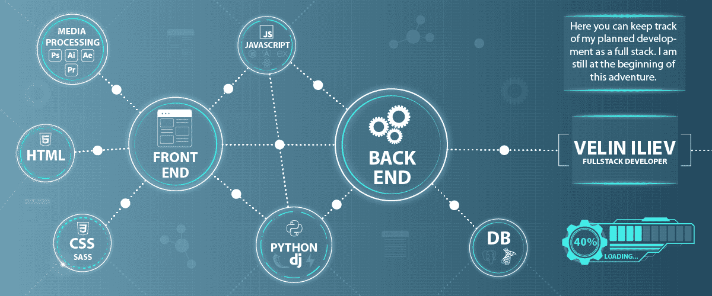

## Hi, I'm Velin Iliev

- passionate full stack developer
- experienced graphic designer
- I'm looking to collaborate on any Open Source Project

### Connect with me:

- **veliniliev@gmail.com**

### Courses:

- Currently, studying Python Full Stack Developer at SoftUni ... [see my progress]
- Certified Python Web Developer at SoftUni / 2022-2023 ([certificate Web Developer])
- Certified Front-End Developer Advanced / 2021
- Certified Front-End Developer / 2020

### Languages:

    
    
    
    
    
    
    
    
    
    
    
    
    
    
    
    
    
    
    

[see my progress]:https://github.com/VelinIliev/SoftUni-Python-Full-Stack-Developer-progress

[certificate Web Developer]: https://softuni.bg/certificates/details/191128/8aab45c5