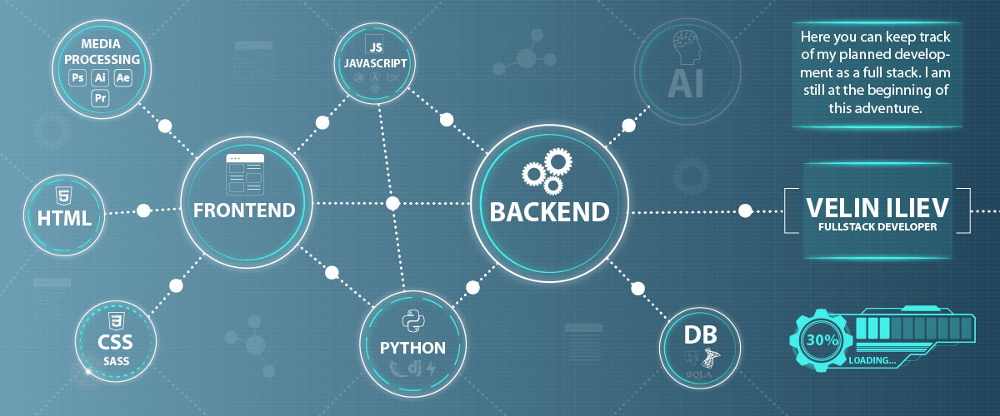

## Hi, I'm Velin Iliev
- passionate full stack developer
- experienced graphic designer
- I'm looking to collaborate on any Open Source Project

### Connect with me:
- **veliniliev@gmail.com**

### Courses:
- Certified Front-End Developer / 2020
- Certified Front-End Developer Advanced / 2021
- Currently, studying Python Web Developer at SoftUni ... [see my progress]

### Languages and tools:

    
    
    
    
    
    
    

[

[see my progress]:https://github.com/VelinIliev/SoftUni-Python-Full-Stack-Developer-progress